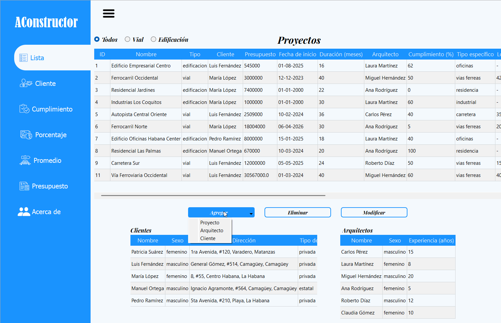

# Proyecto de Gestión de Proyectos de una Empresa Constructiva

## Descripción

Este proyecto es una aplicación de escritorio en Python diseñada para gestionar el registro de proyectos de construcción, así como sus arquitectos y clientes . Permite crear, editar y eliminar arquitectos, clientes y proyectos de dos tipos: edificaciones y obras viales. Además, la aplicación ofrece análisis de datos como cumplimiento, presupuesto y promedio de distancia para ayudar en la toma de decisiones.

## Gif representativo




## Instalación

### Requisitos

- Python 3.8 o superior
- `pip`
- PyQt5 5.15.11


### Pasos de instalación

1. Clona o descarga el repositorio.
2. Navega a la carpeta del proyecto:
   ```bash
   cd ..\Proyecto
   ```
3. Instala las dependencias con pip:
   ```bash
   pip install -r requirements.txt
   ```

## Ejecución y uso

Para iniciar la aplicación, ejecuta el archivo principal desde la carpeta del proyecto:

```bash
python principal.py
```

### Uso general

- Abre la aplicación y navega por el menú principal.
- Registra nuevos arquitectos y clientes.
- Crea proyectos de tipo `edificación` o `vial` asociándolos a clientes y arquitectos existentes.
- Usa las secciones de análisis para ver datos de presupuesto, clientes, cumplimiento, porcentajes y promedios.

## Tecnologías usadas

- `Python` - Lenguaje principal del proyecto.
- `PyQt5` - Biblioteca para crear la interfaz gráfica de usuario.
- `JSON` - Formato para almacenar los datos de arquitectos, clientes y proyectos.

## Funcionalidades actuales

- Registro y administración de arquitectos.
- Registro y administración de clientes.
- Registro de proyectos de edificación y de obras viales.
- Edición y eliminación de registros.
- Verificación de proyectos en uso antes de eliminar arquitectos o clientes.
- Visualización de datos de clientes específicos
- Visualización de datos de presupuesto.
- Control de cumplimiento y análisis de porcentaje.
- Cálculo de promedios relacionados con la gestión de proyectos.

## Estructura del proyecto

- `principal.py`: Punto de entrada de la aplicación.
- `controlador/`: Lógica de control y manejo de eventos.
- `modelo/`: Clases de datos y gestión de JSON.
- `vista/`: Interfaces gráficas y ventanas de la aplicación.
- `vista/ui/`: Archivos `.ui` usados por Qt Designer.
- `vista/img/`: Recursos gráficos y archivos de imagen.

## Notas

- Asegúrate de ejecutar la aplicación desde la carpeta raíz del proyecto para que las rutas relativas de los archivos `.ui` y recursos funcionen correctamente.